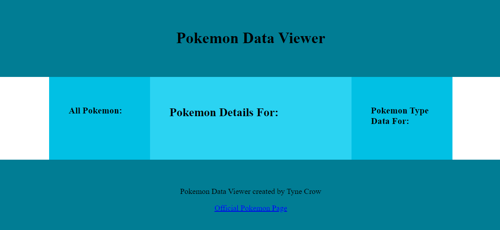
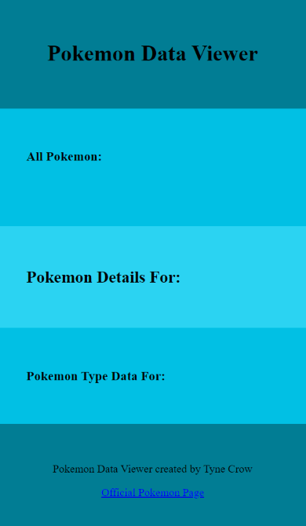
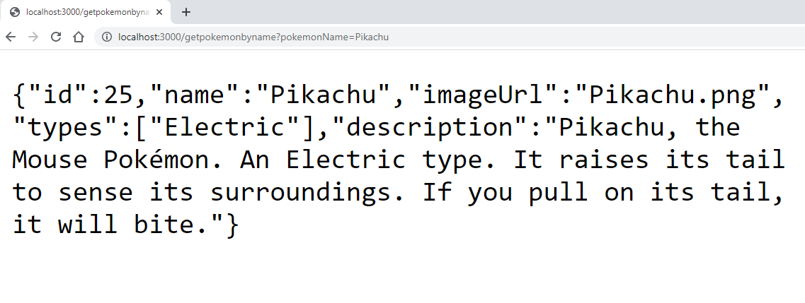
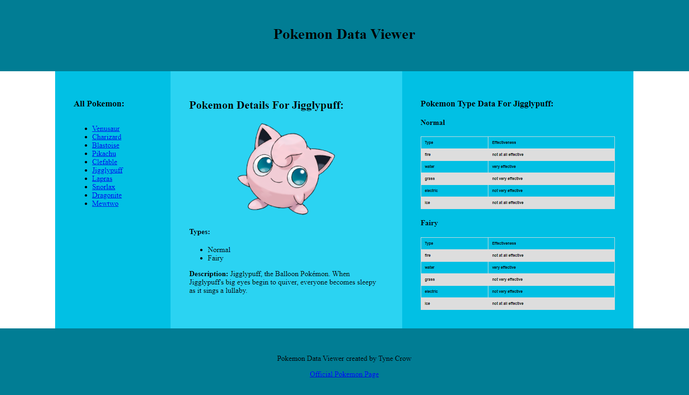

# Web Assignment Pokemon Page

## Overview:

- 6 main steps in the assignment
- 70 marks total
- 10 marks for each of the main steps
- 5 marks for flexibility & robustness
- 5 marks for code quality

## Introduction

In this assignment you will create the client-side and server-side code for a page that will display data about Pokemon. 

The page will use AJAX so that it can dynamically load new data into an already loaded page. 

This will mean that your server-side routing and handler functions will receive AJAX requests and respond with JSON strings; this means you will NOT be using server-side Handlebars for this project. 

You client-side JavaScript code that runs in the user's web browser will request data via AJAX/fetch and then receive the JSON strings and display the content in the page. 

Because you will be using client-side JavaScript you will be creating and modifying code runs in the client's web browser. This will be similar to the code you wrote in first 4 JavaScript labs. The code from the lab focused on AJAX is particularly relevant and you should be familiar with the concepts in lectures/labs 1-11.

You should write all of your code using the technologies taught in the lectures/labs in this course as evidence that you can apply the concetps taught up to this point in the course. You should not use any other larger external libraries, frameworks or pre-written CSS, JS or HTML. It is ok to reuse a few lines of code from other sources as long as you cite it in your comments and have a good justification for using it. Some sections of the assignment give you quite a lot of freedom to research your own design and implementation; it is very important that these steps are your own unique work and that you work on them independently to other students. If you have any doubts about how you are approaching certain tasks or which technologies you are using please email your lecturer to check if it is ok.   

## Structure of project and data

In the project `src` directory you will see that there is a file named `web-assignment-pokemon.js`. This file has the data for your page, functions that will allow you to access this data in your route handler code and the basic code for the server. 

You can create all of your server-side code for the project inside `web-assignment-pokemon.js`. Your server-side code for this project will mainly be route handlers that send JSON data as a response to fetch requests. 

In the `public` directory you have been provided with a blank HTML template `public/index.html` along with an associated JavaScript (`public/scripts/script.js`) and CSS file (`public/style/style.css`). There is also an `images` directory in the `public` directory. Remember that your client-side JavaScript within your public directory cannot directly access the serverside code or data. Your client-side JavaScript will have fetch requests that request JSON data from your server-side route handlers; you will use a single HTML file for this project and modify the content through JavaScript. For the client-side JavaScript you will be creating and modifying HTML elements with JavaScript like you did in the first 4 JavaScript labs; the AJAX/async lab is a particularly useful example to look at. You will NOT be using server-side Handlebars or a views directory.

## General Description of Assignment

You will create a single page that will allow a user to view data about all Pokemon and Pokemon types. As the user selects options on the page, the data will be loaded dynamically from the server with fetch requests and displayed in the page through client-side JavaScript code. 

The page will be responsive and change from a maximum of 3 columns wide for wide screens to a single column layout for smaller screens. The page will be structured with multiple divs that are positioned using CSS grid. 

You will need to create the server-side route handlers in `web-assignment-pokemon.js` that will receive the fetch requests and send the JSON responses. These route handlers will use the structured data that is contained in `web-assignment-pokemon.js` and the functions used to connect with these.

## Git Commit Requirement
You must make a commit + push whenever you complete a feature, and whenever you feel you have achieved a milestone.
This will be used to help monitor your progress on the project, and will also be helpful for you to 
review code changes in the event of [software regressions](https://en.wikipedia.org/wiki/Software_regression).

You must make at least 20 commits in your project. With the following goals for each commit:

- Spend no more than ~30 seconds writing the commit message
- The commit should be meaningful to someone reading your code history
- The changes in the commit should be aimed at solving a particular task, such as:
  - Feature addition
  - Bugfix
  - Improve code quality/readability
  - Documentation
- Commits made just to meet the commit requirement will be ignored
- You should format your code before committing
- At least one commit is required at the completion of each Step.

Any submission that does not meet the git commit requirement is subject to a mark of zero, deductions, and a code interview.

## Running the server

You should have node `v18.17.1` installed
```
$> node --version
v18.17.1
```

Install the required packages using (you can run this command multiple times without issue)
```
$> npm install
```

To automatically restart the server with code changes using [(nodemon)](https://www.npmjs.com/package/nodemon) type:
```
$> npm run dev
```

To run the server without automatic restart type:
```
$> npm run start
```

If everything works you should get the output with the location of your public folder:
```
================================================================================
Pokemon Data Viewer API Server
================================================================================
Public folder for static files: <location of your public folder>
Server is listening on port 3000!
```

# Steps for Tasks: 

## Step 1: Creating the Responsive HTML Template (10 marks):

The page will be made up of 5 separate sections/divs. These will be:

- The header; with the main `h1` heading `Pokemon Data Viewer`
- The main content with a `h2`heading `Pokemon Details For:`
- A sidebar on the left of the main content with a `h3` heading `All Pokemon:`
- A sidebar on the right of the main content with a `h3` heading `Pokemon Type Data For:`
- A footer that notes who the author of the page is (you) and a link to the official Pokemon page (`https://www.pokemon.com/`)

You should think carefully about how you structure your code and how you use ids for your divs as you will need to be dynamically modifying the code with client-side JavaScript in later steps. 

These sections/divs should be structured with the use of a CSS grid and the sections should be laid out like this: 



You do not need to use the same colour scheme as this screen-shot and you will be creating your own unique design in `Step 4`. There are no exact sizes you need to use for padding and margin etc but you need to make sure that the page displays all content appropriately on standard screen sizes. You should keep resizing and testing your page as you develop it to check that it is compatible with text content and images that will be loaded later through AJAX fetch requests in `Step 3`.

You should also make your grid responsive so that on smaller screens it is re-arranged to look like this:



You should test your page and decide carefully at what screen width the 3 column grid layout should change to the single column layout; there is no exact screen size it should but you may need to adjust this to suit the content that is loaded in `Step 3`. 

The text and HTML content in the page at this point is all you will need to create for now; the rest of the data will be loaded into the page with AJAX requests.

When you have finished these steps, it should look similar to the screenshots above but may use different colours. 

## Step 2: Server-side route handlers (10 marks):

The `web-assignment-pokemon.js` file has been setup with the necessary configurations to allow you to add route handlers that will receive AJAX requests and send a JSON reponse. 

You will also see that there is some data at the bottomr of the page and several functions that allow you to get data in different ways. 

In the `web-assignment-pokemon.js`, you will need to write 4 route handlers that can handle the JSON requests for the different data. These route handlers will receive fetch requests from the client-side JavaScript base on events like the page loading or the user clicking on particular links. All 4 route handlers will use the `GET` method.

These route handlers are:
- A `/getPokemonByName` route handler which will take a Pokemon name as a parameter and send a JSON response with the data for that Pokemon; note: there is a `getPokemonByName()` function that you can use
- A `/getAllPokemonNames` route handler which will send a JSON response that is a string array with all of the Pokemon names
- A `/getTypeByName` route handler that will get the type data for a particular type from the `typeData` array 
- A `getRandomPokemon()` route handler that will get a random Pokemon and send the data for that Pokemon as a JSON response

When you have completed these route handlers, you should test them thoroughly to ensure that they are return the correct data. Remember that you can test these in your web browser before writing the fetch requests in your client-side JavaScript by typing the route handler path in the web browser; e.g.: `http://localhost:3000/getRandomPokemon` or `http://localhost:3000/getpokemonbyname?pokemonName=Pikachu`. If the route handlers are setup correctionly and the server is running, you should be able to see the JSON response in the browser.

For example, requesting `http://localhost:3000/getpokemonbyname?pokemonName=Pikachu` should look something like this:



In the next step you will be accessing this data through JavaScript fetch requests that run in the web browser and displaying it in HTML elements; however, it is good to test that every route handler works before moving onto your client-side JavaScript. You should paste the URLs for all 4 of your route handlers into the web browser to test them.

## Step 3: Client-side code for route handlers (10 marks):

**IMPORTANT:** For this step, you are only given the screen-shots and more general requirements. You will need to think very carefully about how you break the task down into steps and apply the knowledge from the relevant lectures and labs. 

Now you should creat the client-side HTML, CSS and JavaScript code to display all of the data in the correct locations in the page through client-side JavaScript fetch requests to your `route handlers`.

The end result should look something like this: 



And on a smaller screen it should all display in a single column. See the image of what it should look like in the `spec` directory.


All of the data displayed in the main 3 divs (left side bar, center column, right side bar) should be requested from the server with fetch requests to the route handlers you created in `Step 3` and dynamically added to your HTML page with JavaScript. You may need to modify the route handlers you created in `Step 2` if you notice anything you need to change. 


**IMPORTANT:** Your code needs to be structured in such a way that if new content is added to the data on the server-side, that content will automatically display in the page. This will be tested when the assignment is marked. For example: if more Pokemon are added to the `pokemonData` array in `web-assignment-pokemon.js`, those Pokemon should automatically display in the page without any changes to the client-side code. If more types are added to an individual Pokemon object's array of types in the object's `types` property, then all of those types should be displayed in the Pokemon's list of types in the center panel and all of the data for those types should be displayed in tables in the right side-bar. 

You should test that your code will work when more data is added by adding new Pokemon to `pokemonData` and more types to `typeData`. Make sure that you try adding Pokemon that have 3 or more types in their `types` property array so you can be sure that your client-side code will dynamically display all of those types and the types tables in the page. 

How you structure your client-side code is up to you but it is STRONGLY suggested that you aim to break the task down into a lot of small functions and steps that you can develop, test and debug. You may modify your CSS and HTML from the earlier steps to add the elements and classes necessary to effectively display the content that is received from the JSON end points. 

Here are the functional requirements for how your client-side code should render the data received from the AJAX fetch requests and allow the user to interact with it: 

* Every time the page is refreshed, the list of all Pokemon in the lefthand side-bar should display the names of all Pokemon in the `pokemonData` array and this data should be received from the server
* The center column should display the image and details of a selected Pokemon as seen in the image above
    * When the page is first loaded or refreshed, a random Pokemon should be loaded as the selected Pokemon; remember that you can use the route handler you created in `Step 2` to load the random Pokemon
    * The list of Pokemon in the lefthand side-bar should have clickable links that will allow the user to click on the link to set that Pokemon as the selected Pokemon and load the data of that particular Pokemon in the center column
* The righthand side-bar should show tables that display the type data for the types related to the currently selected Pokemon
    * If the user selects a new Pokemon from the list, the center column and all type data displayed should change to match the newly selected Pokemon and the type data for that specific Pokemon
        * Make sure to test that all type data in the center column and righthand side-bar changes with every Pokemon and that it functions for Pokemon that have 3 or more types; i..e.: do not hardcode your code to work only with one or two types per Pokemon. 
* The headings within the center column and righhand side-bar should contain the name of the currently selected Pokemon as per the screenshot above; e.g.: `Pokemon Details For Pikachu` and `Pokemon Type Data For Pikachu`. The name of the Pokemon in these headings should always change to match the selected Pokemon when a new Pokemon is selected

## Step 4: Unique CSS and Design (10 marks): 

For this step you should research a carefully chosen design that does not look like the screenshots provided to you. The main constraint is that the content still displays on the page appropriatly for both wide and narrow screens. 

Requirements: 
- Your design must make use of coloured backgrounds for the main divs and cannot be primarily white backgrounds
- You must chose a customised colour palette that does not use default web colours or the colours in the screenshots provided; there are plenty of colour palettes provided online
- You must use a non-standard font or combination of fonts. Make sure that the font suits the general theme of your design
- You must have some font on your page that is not plain black
- You can use extra images and background images if you want but only if they enhance your chosen design and display appropriately on different screen-sizes
- Even though minimalist designs can be effective for this step you must choose a more interesting & complex design that has a clear colour palette and uses extra CSS properties that are beyond just the essentials
    - Examples of extra CSS properties would be rounded corners, transitions, animations, filters, carefully styled borders
- Research a more complex design style carefully and try to replicate it in your site; do not copy large amounts of irrelevant CSS from other places though, you should not be adding CSS that is not directly selecting elements in your page

## Step 5: Research Feature One, Favourites with Client-Side Storage (10 marks):

**IMPORTANT:** This feature is potentially difficult and requires you to research technologies that you have not yet been taught in the course. Only the very general requirements of this are given to you. You have a lot of freedom as to how you implement this feature but it is important that you research and plan carefully before starting the code.

Task outline:
-------------
For this research feature, you must create the ability for a user to add a Pokemon to a list of favourites. that will displayed in the page within a new `favourites section` of the page. When a user has selected an item as a favourite the names and images of their favourite Pokemons should appear in the new section of the page. 

The user should be able to select a Pokemon as a favourite through some sort of link or button that you add to the center column.

**IMPORTANT NOTE ON RESEARCH COMPONENT:** The list of favourite Pokemon must somehow be stored with a client-side browser technology so that if the user closes their browser and reopens the same page in the same web browser, the favourites are still saved from the last time the page was open. There are several technologies with which you could do this; **client-side** `cookies`, `local storage` or `session storage` should all be options that would work. You should research one of these and implement it. 

**Note:** For this research feature you are to research a client-side solution that does not rely on storing the favourites on the server. We will be learning how to store data server-side in databases that is unique to each different user later in the course; however, client-side storage technologies like `cookies`, `local storage` or `session storage` are an important web technology that is used by many modern applications. An advantage of client-side storage in browser in modern applications is that you can store simple settings like favourites or shopping cart items in browser before a user has created an account or signed in; so it is a valuable thing to research and implement.

The `favourites section` should be a separate section of the page that is integrated into your responsive CSS grid so that the whole page still displays on narrow and wide screens. You can chose where in the page the favourites are displayed but make sure that the ways they are displayed fits well with your unique design that you chose in `Step 4`. 

The content in the `favourites section` must display in a way that is functional and looks good no matter how many favourites are selected. It must function for 0, 1 or all of the Pokemon being selected. Think carefully about how you could use modern CSS features like flexbox to accompolish this. 

You should consider the usability of this feature and try to make it as intuitive as possible. It is suggested that users be able to `un-favourite` a Pokemon and remove it from their favourites list in case they accidentally click it or grow to dislike a Pokemon overtime. 

## Step 6: Research Feature Two, Augmenting Your Site with a Third-Party API (10 marks): 

**IMPORTANT:** This feature is potentially difficult and requires you to research technologies that you have not yet been taught in the course. You have a lot of freedom as to how you implement this feature but it is important that you research and plan carefully before starting the code.

API stands for `application programming interface` which is the interface that allows two different applications to talk to each other. In this assignement, you have created a simple API with your route handlers that allow your client-side application (your web browser) to request JSON data from your server-side application (your NodeJS server). It is common for applications to interface with more than one api to function. There are many open and free to access APIs on the internet that enable us to enhance the applications we are building. 

PokeAPI - [https://pokeapi.co/](https://pokeapi.co/) - is a large open API that allows you to request a wide range of Pokemmon data. For example: try putting this URL `https://pokeapi.co/api/v2/pokemon/ditto` into your web browser. You can read the more indepth documentation about PokeAPI here: [https://pokeapi.co/docs/v2](https://pokeapi.co/docs/v2).

Your task is to use at least one fetch request to the PokeAPI in your client-side code to display some extra data relating to the selected Pokemon that is displayed in the center column of your page. This extra data may be displayed within the center column or a new section of the page that you create. You should aim not just to show a single extra word and chose some meaningful information to display. You may supplement this extra data with images extra images if you wish. 

As with the unique design for your page, you should think creatively about what you do in `Step 6` and aim to uniquely add some new information to your page with the use the PokeAPI. There is no right or wrong answer but the extra data should be displayed clearly in the page so that it is obvious to the marker what you have implemented in this step. You should also make sure that your JavaScript code is written in a way that the rest of the page will still function if the PokeAPI happens to be offline. 

**Note on APIs in general:** 
APIs are an area that can become very indepth. There is a lot of theory behind how to design effective APIs and most modern software applications structure interactions between the client/user-interface/web-browser and one or more servers through well designed APIs. You will have a chance to learn and research more about APIs later in the course but you should make sure to do a bit of reading/research about them as you complete this step and integrate PokeAPI into your page. 


## Flexibility & Robustness (5 marks):

### Robustness:

Your page should display appropriately regardless of what combination of links/buttons the user clicks and what size their screen is. You should make sure that the page never crashes. You should also make sure that your JavaScript code is written in a way that the page will not crash completely if any one individual fetch request fails. Remember that if you have completed `Step 6` you will have a call to an external API and there is no guarantee that server will always be running. 

Most importantly, make sure that the code you submit is as functional as possible. **IF** there are sections you have not completed that cause bugs, you should organise the code so that these sections are commented out or not called so the page can still be tested for marking. The marker will potentially look at commented out code to give partial marks for partially complete features but they should NOT need to fix bugs just to see what has been completed on earlier features. 

### Flexibility:

The code should be able to easily allow future changes to functionality and the underlying data. If you use lots of smaller functions with well chosen parameters this should help code cope with changes to the underlying data or new features. You should use this opportunity to read a bit more about the general concept of flexibility in programming/computer science as it is a fundamental principle that is relevant for all programming contexts. At a bare minimum, your code must be able to cope with new data being entered in the server-side data and display it automatically. You should not have any hardcoded references to specific Pokemon or types. If new Pokemon are added or existing Pokemon are changed or deleted, the client-side JavaScript code should display the updated data and shouldn't have any hardcoded references to the default data.

### Code Quality (5 marks):

For all client-side and server-side code you have created you should aim to use good code quality. 

This should include:
- Using well chosen variable and function names that would make it easy for another person to understand the intent of all variables and functions
- Use functions effectively, it is good coding practice to use lots of shorter functions/methods and avoiding repetition or nesting many control structures together (e.g. many loops inside loops or lots of if statements inside other if statements ); use parameters and return values from functions where appropriate
    - You may want to do some extra reading/research relating to the theory of how to use functions well; the AJAX lab in this course has lots of examples of how to structure AJAX in client-side JavaScript well
- All code should be indented in a way that makes levels of nesting obvious to anyone viewing or editing the code
- You should aim to use `white space` and blank lines as appropriate to add space around operators and functions
- You should follow clear conventions & consistent for things like variables, functions, ids etc 
- Your CSS should use selectors efficiently so as to avoid repetition of properties that are common across multiple types of elements; consider things like using CSS variables so that you only set things like colours and margin sizes in one place rather than repeating values many times that may later need to be changed in multiple places
- You should good coding practice like using constants where appriate and scoping variables according to good practice; only make non-function scoped variables if there is a good reason to


